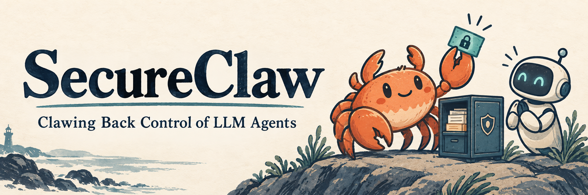
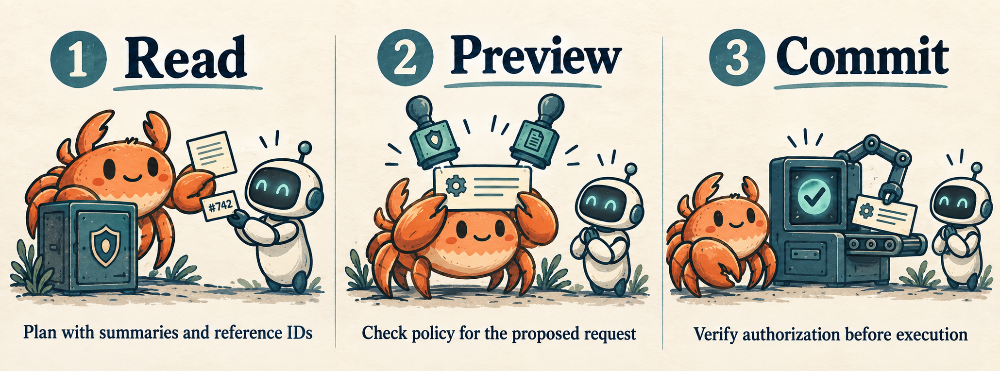

<p align="center">
  
</p>

<p align="center">
  <a href="https://openreview.net/forum?id=0omFi3ZiBf"></a>
  <a href="#quick-start"></a>
  <a href="https://github.com/ponyyuhan/SecureClaw/actions/workflows/tests.yml"></a>
  <a href="LICENSE"></a>
</p>

<p align="center">
  <a href="https://openreview.net/forum?id=0omFi3ZiBf"><b>Paper</b></a> ·
  <a href="#quick-start">Quick start</a> ·
  <a href="#how-it-works">How it works</a> ·
  <a href="experiments/README.md">Experiments</a> ·
  <a href="docs/README.md">Documentation</a> ·
  <a href="#citation">Citation</a>
</p>

**SecureClaw separates an agent's planning from its access to sensitive data and authority to act.** The agent works with short summaries and reference IDs; trusted runtime components retain protected values, check policy, and execute authorized requests.

This is the code for **[SecureClaw: Clawing Back Control of LLM Agents](https://openreview.net/forum?id=0omFi3ZiBf)**, by **Yuhan Ma and Stefan Schmid**, accepted at **NeurIPS 2026**. It includes the runtime, method adapters, evaluation runners, scoring code, configurations, and tests.

## Quick start

**Python 3.11+ · macOS or Linux · no API key needed for the local demo.**

```bash
git clone https://github.com/ponyyuhan/SecureClaw.git
cd SecureClaw
python3 -m venv .venv
source .venv/bin/activate
python -m pip install -r requirements.txt

# Start two policy servers, the executor, and the gateway.
bash scripts/dev_up.sh
bash scripts/check_health.sh

# Check the runtime and try benign and malicious agent actions.
python scripts/validate_runtime.py
python main.py agent-demo both

# Stop the local services.
bash scripts/dev_down.sh
```

The demo uses synthetic secrets and simulated message, fetch, and webhook sinks. It makes no hosted-model calls and sends no external messages. Logs and local state are written under `.runtime/`.

See the **[setup guide](docs/quickstart.md)** for expected behavior, ports, troubleshooting, and platform-specific capsule checks.

## How it works

<p align="center">
  
</p>

1. **Read through the gateway.** Protected values stay in trusted storage. The agent receives reference IDs (opaque handles) and the permitted summary view.
2. **Preview the proposed action.** Policy checks bind authorization to the canonical request and its execution context.
3. **Commit the authorized request.** The executor verifies both policy-server MACs, request binding, freshness, and replay state before executing the action.

The runtime also provides mediation for final output, inter-agent messages, persistent memory, and skill ingress. The **[paper-to-code map](docs/paper_to_code.md)** links each mechanism to its implementation and tests, including the distinction between the local demo's redacted previews and the benchmark adapters' schema-aware summaries. The illustration above is a conceptual overview; the source map describes the individual trusted components.

## Experiments

| Start here | What it covers |
| --- | --- |
| [Primary evaluations](experiments/README.md) | AgentDojo, Agent Security Bench (ASB), and AgentLeak; dependency retrieval, configurations, runners, and scoring |
| [Additional evaluations](rebuttal/README.md) | Model transfer, adapted baselines, field classification, and accommodation experiments |
| [Mechanism evaluations](experiments/mechanism_evaluations.md) | Authorization checks, summary diagnostics, recovery behavior, and timing |
| [Implementation checks](experiments/implementation_checks.md) | Regression coverage and the scope of the different evaluation paths |

Benchmark sources are retrieved at recorded revisions, with integration patches and third-party license notices included. Runs generate their own outputs; stored results, model transcripts, caches, and temporary engineering files are excluded. See the [release scope](docs/paper_to_code.md#results-and-reproducibility) for the source inventory and exclusions.

## Tests

Run the portable tests from the repository root:

```bash
python -m unittest discover -s tests -v
```

To include the AgentDojo/ASB method-adapter checks, install the optional test dependency in a **Python 3.11** environment, then rerun the suite:

```bash
python -m pip install -r method_adapters/agentdojo/requirements.txt
python -m unittest discover -s tests -v
```

The tests use synthetic inputs and do not call hosted models. Checks that need the optional adapter dependency are reported as skipped when it is absent. [GitHub Actions](.github/workflows/tests.yml) runs the offline suite on Linux and macOS, plus local runtime validation on Linux.

## Agent integrations

The gateway supports **HTTP and MCP**. An [MCP configuration example](mcp_config.example.json) and optional **OpenClaw** and **NanoClaw / Claude Agent SDK** adapters are included.

See **[agent integrations](docs/integrations.md)** for setup. MCP mediates the tools routed through SecureClaw; complete mediation also requires restricting the agent's other execution paths. OS capsule examples are provided separately for macOS and Linux.

## Repository guide

| Directory | Contents |
| --- | --- |
| [`gateway/`](gateway/) | Handles, summaries, routing, policy client, and mediated operations |
| [`policy_server/`](policy_server/) · [`fss/`](fss/) | Policy evaluation and DPF-based private lookup |
| [`executor_server/`](executor_server/) | Request-bound authorization verification and simulated action sinks |
| [`secureclaw/`](secureclaw/) · [`common/`](common/) | Task capsules, canonical requests, tokens, and shared utilities |
| [`capsule/`](capsule/) · [`spec/`](spec/) | OS mediation examples and protocol specifications |
| [`method_adapters/`](method_adapters/) | Benchmark-facing method implementations |
| [`experiments/`](experiments/) · [`scripts/`](scripts/) · [`rebuttal/`](rebuttal/) | Evaluation setup, runners, and scoring |
| [`agent/`](agent/) · [`integrations/`](integrations/) | Local agent demo and optional client adapters |
| [`tests/`](tests/) | Offline regression tests |

The optional [`policy_server_rust/`](policy_server_rust/) implementation is not required for the Python quick start.

## Configuration

Development settings are documented in [`.env.example`](.env.example). Shell launchers read exported environment variables; they do not load `.env` automatically. The defaults use loopback services, synthetic credentials, signed policy responses, and persistent executor replay state.

For real-data deployments, configure private keys and authenticated callers, separate the policy-server trust domains, connect real action backends, and enforce the intended OS boundary. See **[configuration and deployment](docs/configuration.md)** for these assumptions and the existing research switches.

## Citation

```bibtex
@inproceedings{ma2026secureclaw,
  title     = {SecureClaw: Clawing Back Control of LLM Agents},
  author    = {Ma, Yuhan and Schmid, Stefan},
  booktitle = {Advances in Neural Information Processing Systems},
  year      = {2026},
  url       = {https://openreview.net/forum?id=0omFi3ZiBf}
}
```

Machine-readable metadata is available in [CITATION.cff](CITATION.cff).

## Contributing and license

Bug reports and focused contributions are welcome. See [CONTRIBUTING.md](CONTRIBUTING.md) for development and testing instructions.

SecureClaw is released under the **[MIT License](LICENSE)**. Third-party code retains its original licenses; see [attribution](experiments/THIRD_PARTY.md) and adapter notices. Source provenance and maintenance notes are recorded in [release notes](docs/release_notes.md).
